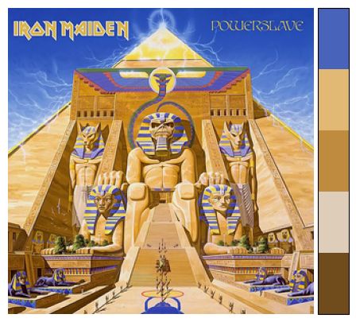
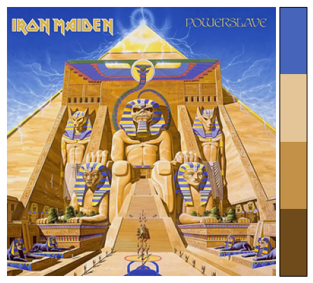
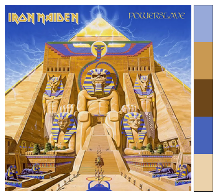

# covers2colors

## Installation

Clone the repo, navigate inside it and use ``pip install .``

For detailed instructions and command line usage see [USAGE.md](USAGE.md).
You can enter the artist and album without quotes by placing a dash between
them, e.g. ``coverpalette artist - album``.  You can also list saved palettes
with ``coverpalette list``.  Run ``coverpalette list --pdf`` to open a PDF
showing the stored palettes.

### API access to album covers
Before installation, consider setting up some API keys if you so wish.

To get album covers I try 3 different APIs (Last.fm, MusicBrains, and Discogs), two of which require API keys (Last.fm and discogs). Last.fm is the preferred API. 

To set up your API keys, you can rename `covers2colors/keys_template.json` to `covers2colors/keys.json` and add your API keys in there. If this file is missing, the package will look for the environment variables `LASTFM_API_KEY` and `DISCOGS_TOKEN`.

If you would rather not bother getting any API keys, artwork will attempt to be fetched from MusicBrainz only. things should still work fine, although the MusicBrains API can be slow. I've also noticed that the color on some album covers appear muted on Discogs and MusicBrains.

## Basic Usage

**Create colormaps from album covers in three lines of code!**

First, the ``CoverPalette`` class makes calls to various APIs in order to fetch album artwork, and converts the image to arrays of RGB values.
Then, ``generate_cmap`` creates a matplotlib [ListedColormap](https://matplotlib.org/stable/api/_as_gen/matplotlib.colors.ListedColormap.html#matplotlib-colors-listedcolormap).


    from covers2colors import CoverPalette

    coverpalette = CoverPalette('iron maiden', "powerslave")
    cmap = coverpalette.generate_cmap(n_colors=5, random_state=42)

Now, use the colormap in your plots!

    import matplotlib.pyplot as plt

    colors = cmap.colors

    with plt.style.context("dark_background"):
        for i, color in enumerate(colors):
            plt.plot(range(10), [_+i+1 for _ in range(10)], color=color, linewidth=4)


Plot the image and a colorbar side by side with the following method:

    covercolors.display_with_colorbar(cmap)



## Other colormap methods

### generate_optimal_cmap

You can extract the optimal number of colors from the image using the ``generate_optimal_cmap`` method.
Under the hood this performs the [elbow method](https://en.wikipedia.org/wiki/Elbow_method_(clustering))
to determine the optimal number of clusters based on the sum of the squared distances between each pixel
and it's cluster center.


    cmaps, best_n_colors, ssd = covercolors.generate_optimal_cmap(max_colors=10, random_state=42)

    best_cmap = cmaps[best_n_colors]



This method is great if you don't have a preference for how many colors are in your color palette.

### get_distinct_colors

Suppose you have a collection of colors in your color palette, but you only want to select a subset from them. This method will select the most distinct colors out of the palette for your new, smaller color palette.


    cmap = cmaps[10] # here I'm using the cmap with 10 colors from running the above code
    distinct_colors, distinct_cmap = covercolors.get_distinct_colors(cmap, 5)

### generate_distinct_optimal_cmap

Another method you can use to get a color map. This method employs the generate_optimal_cmap and then finds the most distinct set of ``n_distinct_colors`` colors.


    distinct_colors, distinct_cmap = covercolors.generate_distinct_optimal_cmap(n_distinct_colors=6)




Notice how this palette differs from the first palette generated by `generate_cmap`!

The different methods of obtaining a palette will often return different palettes for the name number of colors, ``generate_distinct_optimal_cmap``appears to be the one that performs the best imo, but results vary (which is why there are options!).

### Hexcodes

When running the ``generate_cmap`` or the ``generate_optimal_cmap`` methods the CoverPalette object will automatically
capture the resulting hexcodes from the colormap and store them as an attribute.


    from covers2colors import CoverPalette

    coverpalette = CoverPalette('Nirvana', 'Nevermind')
    coverpalette.generate_cmap(n_colors=4, random_state=42)
    print(coverpalette.hexcodes)

Output:


    ['#0ea1c1', '#456a78', '#0269ae', '#091a2d']

### Saving and loading palettes

You can store a palette and reload it later using ``save_palette`` and
``load_palette``. Palettes are recorded in a JSON index under
``~/.covers2colors/palettes/index.json``. Calling ``save_palette`` without a
filepath saves just to this index; you can also provide a path to write the
hexcodes to a separate JSON file.

```python
from covers2colors import CoverPalette

colors = CoverPalette('Nirvana', 'Nevermind')
colors.generate_cmap(n_colors=4, random_state=42)
# Save with automatic naming
colors.save_palette()

# List stored palettes
for p in CoverPalette.list_palettes():
    print(p['name'], p['n_colors'])

# Find palettes with five colors
for p in CoverPalette.find_palettes_by_color_count(5):
    print(p['name'])

# ...in another session
new_colors = CoverPalette('Nirvana', 'Nevermind')
new_colors.load_palette_by_name('nirvana_nevermind_4')
print(new_colors.hexcodes)
```

